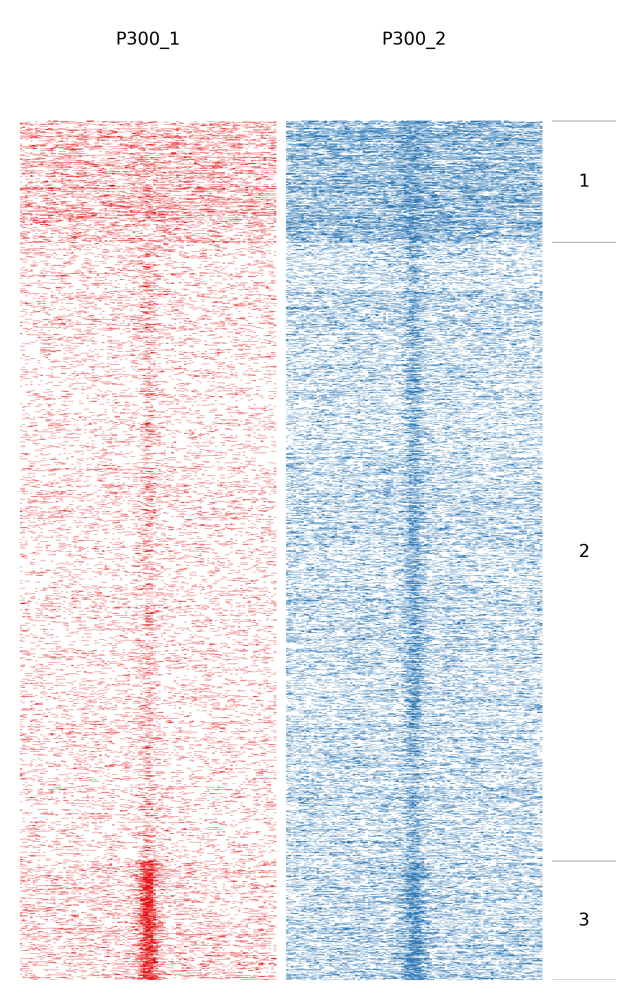
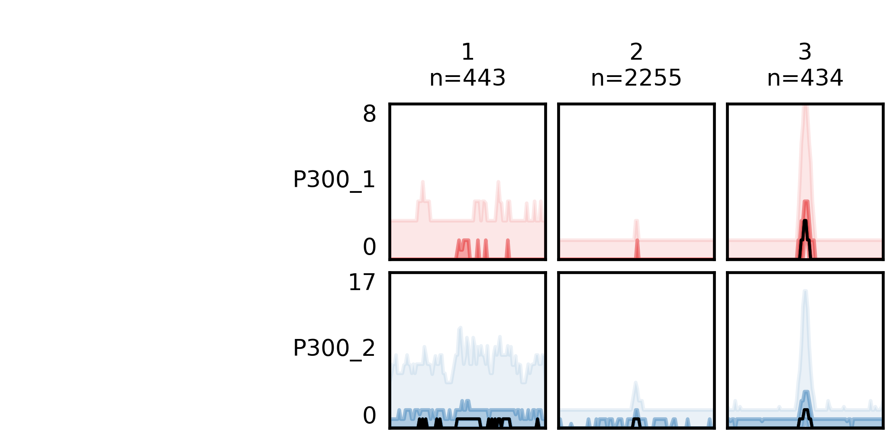
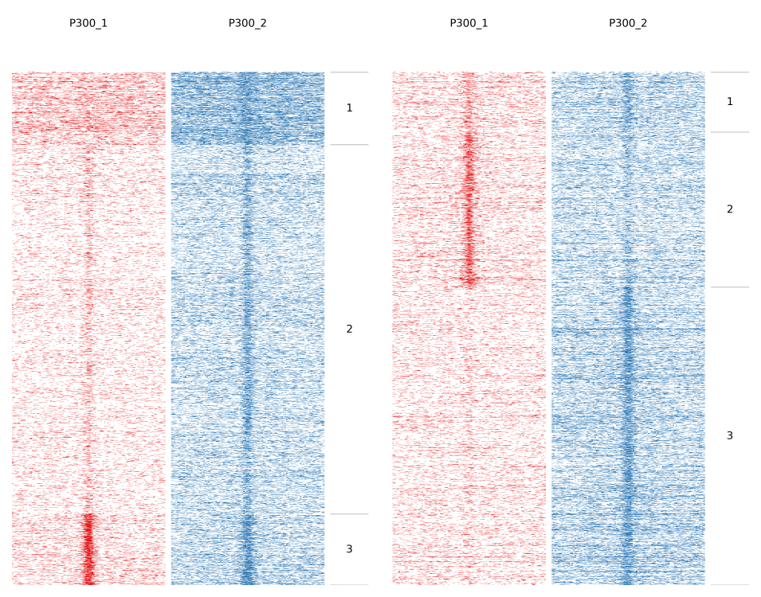

Usage
=====

You can try fluff with a small example dataset included in the examples directory, included with fluff. This example does not require any additional configuration if fluff is installed correctly.
Go to examples directory:

Quick fluff heatmap example
---------------------------

With ``-f`` option you specify the features file, which should a BED file. Then the data file(s) with ``-d`` option. This can be a BAM or BED file. With ``-o`` you define the name of the output file. fluff heatmap outputs three file. The heatmap image, a bed file with the features and the clusters and the read counts for each feature.

::

    fluff heatmap -f data/P300.bed -d data/P300_1.bam data/P300_2.bam -o P300

The previous command produces a heatmap "as is", preserving the order in the input file. If you want to cluster you features use the following command. With ``-C`` you can select which clustering method you want. In case you selected k-means you should use ``-k`` to declare how many clusters you want.

::

    fluff heatmap -f data/P300.bed -d data/P300_1.bam data/P300_2.bam -C kmeans -k 3 -o P300_kmeans3

Quick fluff bandplot example
----------------------------

With ``-f`` option you specify the _clusters.bed file, which you got from fluff heatmap, and with ``-d`` the data file(s). Again, you can use ``-o`` to define the name of the output file, which is the bandplot image.

::

    fluff bandplot -f P300_kmeans3_clusters.bed -d data/P300_1.bam data/P300_2.bam -o P300_kmeans3_bandplot

If case you want to use fluff bandplot on the same dataset as you ran fluff heatmap you can use ``-counts`` option, without ``-d`` option. Here the input is the _readCounts.txt file from fluff heatmap. This option is faster because it doesn't have to re-read the data files to get the reads.

 ::

    fluff bandplot -f P300_kmeans3_clusters.bed -counts P300_kmeans3_readCounts.txt -o P300_kmeans3_bandplot

Quick fluff profile example
---------------------------

If you want to show a genomic region as a dense plot, like a genome browser screenshot, you can you fluff profile.
You give the feature(or features separated by ``,``) using the ``-i`` option, followed by ``-d`` for the data file(s). With ``-o`` you give the output file name, which is an image.

    ::

    fluff profile -i scaffold_10:33468035-33543146 -d data/P300_1.bam data/P30bam -o scaffold_10_33468035_33543146

.. image:: ../examples/scaffold_10_33468035_33543146.png

    ::

    fluff profile -i scaffold_10:33468035-33543146 -d data/P300_1.bam data/P300_2.bam -a data/annotation.bed -o scaffold_10_33468035_33543146_annotation

.. image:: ../examples/scaffold_10_33468035_33543146_annotation.png

Identify dynamic patterns
-------------------------

One important function of fluff is the ability to identify dynamic patterns, for instance during different time points or conditions.

 ::

    fluff heatmap -f data/P300.bed -d data/P300_1.bam data/P300_2.bam -g -M Pearson -C kmeans -k 3 -o P300_kmeans3_dynamic

.. image:: ../examples/P300_kmeans3_dynamic.png

 ::

    fluff bandplot -f P300_kmeans3_dynamic_clusters.bed -d data/P300_1.bam data/P300_2.bam -o P300_kmeans3_dynamic_bandplot

 ::

    fluff bandplot -f P300_kmeans3_dynamic_clusters.bed -counts P300_kmeans3_dynamic_readCounts.txt -o P300_kmeans3_dynamic_bandplot

.. image:: ../examples/P300_kmeans3_dynamic_bandplot.png