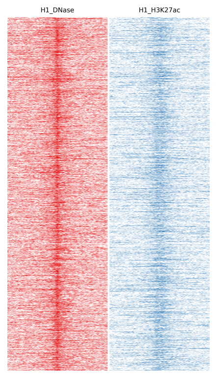
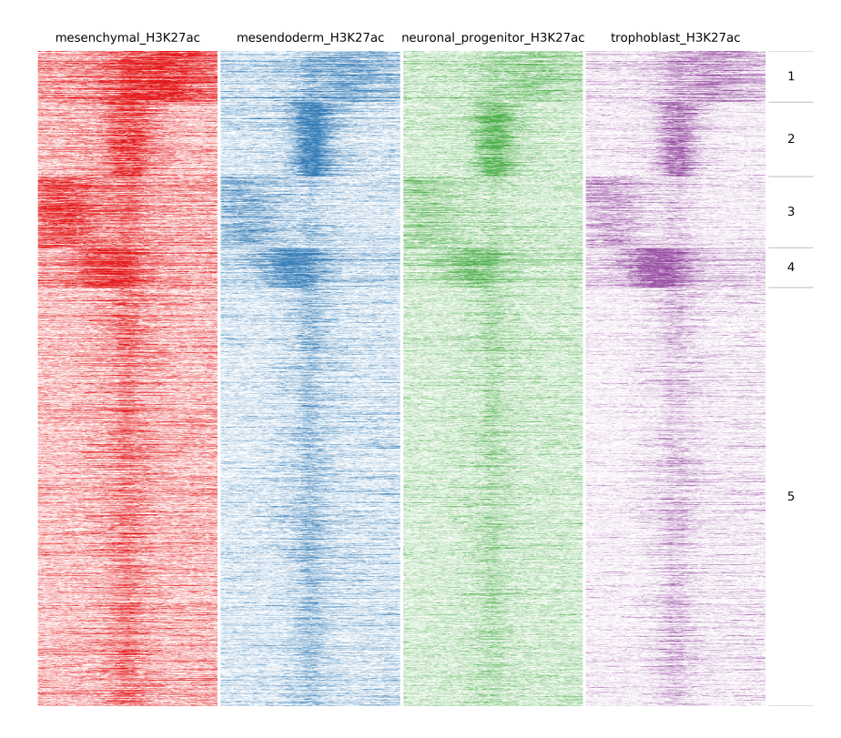
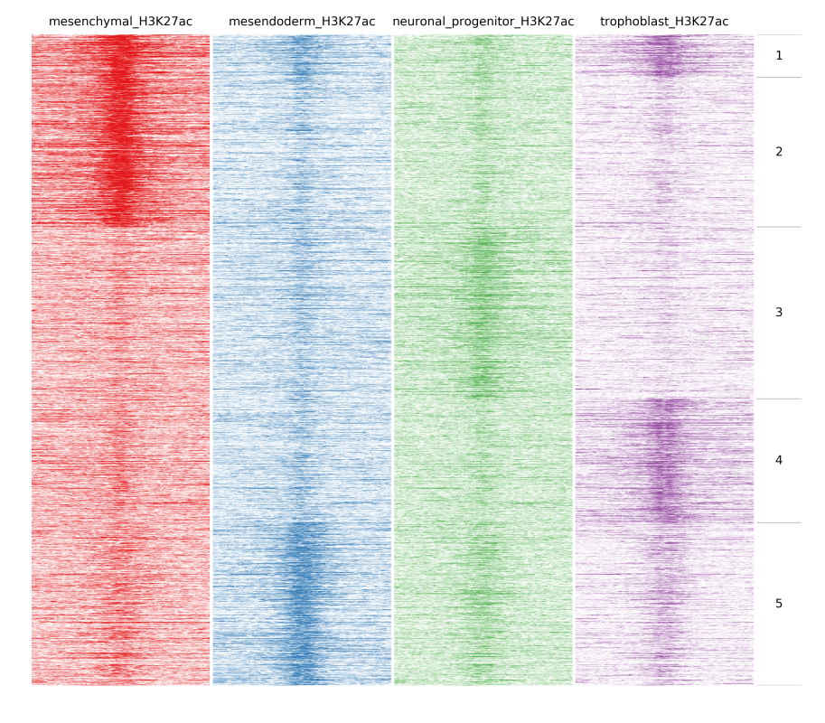
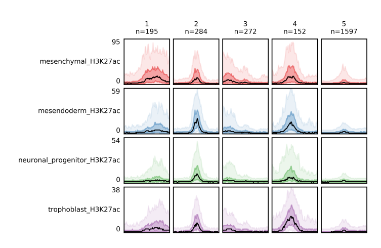
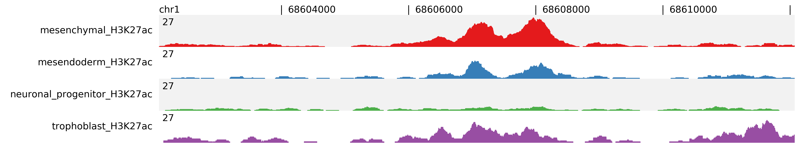
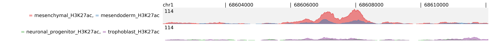

Usage
=====

You can try fluff with an example dataset from ENCODE. To download the files just visit https://figshare.com/articles/fluff_example_data/3113728 and click ``Download all``.
Once the download is done, unzip it and go to the directory. Inside you will find 6 BAM files, with their indexes, and a BED file.

Quick fluff heatmap example
---------------------------

**As is**

This example produces a heatmap "as is", preserving the order in the input file.
With ``-f`` option you specify the features file, which should a BED file. Then the data file(s) with ``-d`` option. This can be a BAM or BED file. With ``-o`` you define the name of the output file. fluff heatmap outputs three file. The heatmap image, a bed file with the features and the clusters and the read counts for each feature.
Here we will compare H1 DNase and H1 H3K27ac:

::

    $ fluff heatmap -f example_peaks.bed -d H1_DNase.bam H1_H3K27ac.bam -o H1

**Clustering**

If you want to cluster you features use the following command. With ``-C`` you can select which clustering method you want. In case you selected k-means you should use ``-k`` to declare how many clusters you want.
Here we will compare the different H3K27ac files:

::

    $ fluff heatmap -f example_peaks.bed -d mesenchymal_H3K27ac.bam mesendoderm_H3K27ac.bam \
    neuronal_progenitor_H3K27ac.bam trophoblast_H3K27ac.bam -C k -k 5 -o H3K27ac_kmeans5

**Identify dynamic patterns**

In the previous example peaks were clustered based on the amount of reads at each bin. An important function of fluff is the ability to identify dynamic patterns, for instance during different time points or conditions. If we want to find any dynamics in H3K27ac we can use ``-g`` option and ``Pearson`` as distance metric:

::

    $ fluff heatmap -f example_peaks.bed -d mesenchymal_H3K27ac.bam mesendoderm_H3K27ac.bam \
    neuronal_progenitor_H3K27ac.bam trophoblast_H3K27ac.bam -C k -k 5 -g -M Pearson -o H3K27ac_kmeans5_dynamics

In the following image heatmaps, produced by normal clustering (a) and using dynamics options (b), have been put next to each other for better comparison.
As you can see in (a), there are not any dynamic clusters. Clusters seem to be the same across stages. On the other hand in (b), you can see the cluster 2 where there is increased signal in the first sample compared to the rest. Likewise on cluster 4 and 5, you see increased signal from trophoblast and mesendoderm respectively.

.. image:: img/norm_dynam_heatmaps.png

You can use ``-r`` option to normalize using RPKM (Reads Per Kb per Million reads), instead of read counts.
Quick fluff bandplot example
----------------------------

With ``-f`` option you specify the _clusters.bed file, which you got from fluff heatmap, and with ``-d`` the data file(s). Again, you can use ``-o`` to define the name of the output file, which is the bandplot image.

::

    $ fluff bandplot -f H3K27ac_kmeans5_clusters.bed -d mesenchymal_H3K27ac.bam mesendoderm_H3K27ac.bam \
    neuronal_progenitor_H3K27ac.bam trophoblast_H3K27ac.bam -o H3K27ac_kmeans5_bandplot

If case you want to use fluff bandplot on the same dataset as you run fluff heatmap you can use ``-counts`` option, without ``-d`` option. Here the input is the _readCounts.txt file from fluff heatmap. This option is faster because it doesn't have to re-read the data files to get the reads.

::

    $ fluff bandplot -f H3K27ac_kmeans5_clusters.bed -counts H3K27ac_kmeans5_readCounts.txt -o H3K27ac_kmeans5_bandplot

Similarly to ``fluff heatmap``, you can use ``-r`` option to normalize using RPKM (Reads Per Kb per Million reads), instead of read counts.

Quick fluff profile example
---------------------------

If you want to show a genomic region as a dense plot, like a genome browser screenshot, you can you fluff profile.
You give the feature(or features separated by ``,``) using the ``-i`` option, followed by ``-d`` for the data file(s). With ``-o`` you give the output file name, which is an image.

::

    $ fluff profile -i chr1:68602071-68612071 -d mesenchymal_H3K27ac.bam mesendoderm_H3K27ac.bam \
    neuronal_progenitor_H3K27ac.bam trophoblast_H3K27ac.bam -o profile_chr1_68602071_68612071

.. image:: img/profile_chr1_68602071_68612071.png

With ``-n`` option, profiles can be normalized to "per million reads". Here the files are normalized and assigned to the same scale group.

::

    $ fluff  profile -i chr1:68602071-68612071 -d mesenchymal_H3K27ac.bam \
    mesendoderm_H3K27ac.bam neuronal_progenitor_H3K27ac.bam trophoblast_H3K27ac.bam -n -s 1:4  -o profile_chr1_68602071_68612071_normalized

For better comparison you can overlap tracks, by combining  track groups, ``-t``, and scale groups, ``-s``, options. In the following example we group Mesenchymal with Mesendoderm and  Neuronal Progenitor with Trophoblast.

::

    $ fluff profile -i chr1:68602071-68612071 -d mesenchymal_H3K27ac.bam mesendoderm_H3K27ac.bam \
    neuronal_progenitor_H3K27ac.bam trophoblast_H3K27ac.bam -t 1:2,3:4 -s 1:2 -o profile_chr1_68602071_68612071_overlap

