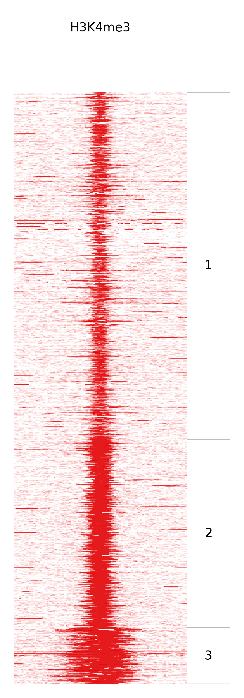

Usage
=====

.. _quick-example:

fluff heatmap
-------------

::

    fluff heatmap -f <BED> -d <BAM> <BAM> -o <NAME>

:scale: 10 %
    :alt: fluff heatmap

Options
~~~~~~~

Required arguments:
~~~~~~~~~~~~~~~~~~~

-  ``-f`` FILE
This need to be a BED file containing features. BED-fomatted files need to contain at least three tab-seperated columns describing chromosome name, start and end.

-  ``-d`` [FILE [FILE ...]]
This option is for the data files. They should be aligned sequence data in BAM or BED format.

-  ``-o`` name
This option defines the name of the output files (type determined by extension)

Clustering:
~~~~~~~~~~~

-  ``-C`` METHOD
By default, fluff heatmap will preserve the order of the features in the input BED file. This is equivalent to specifying -C none. Alternatively, one of two basic clustering methods can be specified using the -C parameter: hierarchical and kmeans. If kmeans is selected the number of clusters (-k) is mandatory.

-  ``-k`` INT
Select the number of clusters (Mandatory with kmeans clustering)

-  ``-M`` METHOD
There are two options for distance metrics. Euclidean or Pearson (default: Euclidean)

-  ``-g``
Identify dynamics between different time points or conditions. This should be used with Pearson correlation coefficient as distance metric

-  ``-p`` PICK
Pick specific data file(s) to use for clustering. You can select using its position e.g -p 1 for first file or -p1,3 for first and third files.

Data processing:
~~~~~~~~~~~~~~~~

-  ``-e`` INT
extend (in bp. Default: 5000)

-  ``-b`` INT
bin size (default 100)

-  ``-F`` FRAGMENTSIZE
Fragment length (default: read length)

-  ``-r``
use RPKM instead of read counts

-  ``-D``
keep duplicate reads (removed by default)

-  ``-R``
keep reads with mapq 0 (removed by default)

-  ``-m``
merge mirrored clusters (only with kmeans and without -g option)

-  ``-s`` SCALE
scale (absolute or percentage)

Visualization:
~~~~~~~~~~~~~~

-  ``-c`` NAME(S)
color(s) (name, colorbrewer profile or hex code)

-  ``-B`` NAME(S)
background color(s) (name, colorbrewer profile or hex code)

Other:
~~~~~~

-  ``-h``
show help message

-  ``-P`` INT
number of CPUs (default: 4)

fluff bandplot
--------------

::

    fluff bandplot -f <BED> -d <BAM> <BAM> -o <NAME>

Options
~~~~~~~

Required arguments:
~~~~~~~~~~~~~~~~~~~

-  ``-f`` FILE
BED file with cluster in 5th column

-  ``-d`` [FILE [FILE ...]]
data files (reads in BAM or BED format)

-  ``-counts`` FILE
read counts table (instead of data files)

-  ``-o`` name
output file (type determined by extension)

Data processing:
~~~~~~~~~~~~~~~~

-  ``-S``
create summary graphs

-  ``-b`` INT
number of bins

-  ``-F`` FRAGMENTSIZE
fragment length (default: read length)

-  ``-D``
keep duplicate reads (removed by default)

-  ``-r``
keep repeats with mapq 0 (removed by default)

-  ``-R``
keep repeats (removed by default, bwa only)

-  ``-s`` GROUPS
scale groups

-  ``-p`` INT,INT
range of percentiles (default 50,90)

-  ``-P`` INT
Percentile at which to extract score. Value should be in range [0,100] (default 90)

Visualization:
~~~~~~~~~~~~~~

-  ``-c`` NAME(S)
color(s) (name, colorbrewer profile or hex code)

Other:
~~~~~~

-  ``-h``
show help message

fluff profile
-------------

::

    fluff profile -i <GENOMIC LOCATION> -d <BAM> <BAM> -o <NAME>

Options
~~~~~~~

Required arguments:
~~~~~~~~~~~~~~~~~~~

-  ``-i`` INTERVAL(S)
one or more genomic intervals (chrom:start-end)

-  ``-d`` [FILE [FILE ...]]
data files (reads in BAM or BED format)

-  ``-o`` name
output file (type determined by extension)

Data processing:
~~~~~~~~~~~~~~~~

-  ``-a`` FILE
annotation in BED12 format

-  ``-t`` GROUPS
track groups

-  ``-s`` GROUPS
scale groups

-  ``-S`` SCALE
scale: 'auto' (default), 'off' or int for each track

-  ``-f`` FRAGMENTSIZE
fragment length (default: 200)

-  ``-D``
keep duplicate reads (removed by default)

-  ``-R``
keep repeats (removed by default, bwa only)

-  ``-r``
reverse

Visualization:
~~~~~~~~~~~~~~

-  ``-c`` NAME(S)
color(s) (name, colorbrewer profile or hex code)

-  ``-b`` BACKGROUND
background color: white | color | stripes

Other:
~~~~~~

-  ``-h``
show help message
